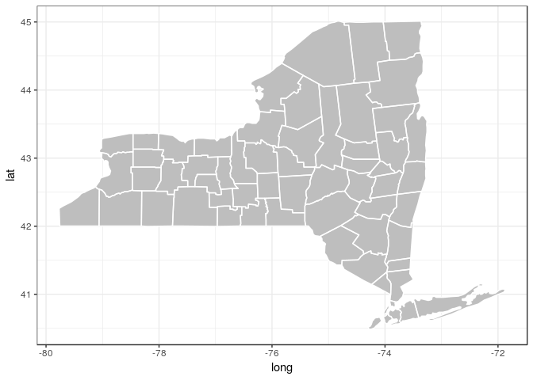
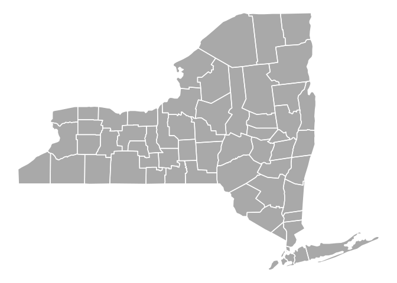

New York State County Map
================

``` r
ny = map_data("state") %>% 
  filter(region == "new york")

ny_county = map_data("county")  %>% 
  filter(region == "new york")


ggplot() + geom_polygon(data = ny, aes(x = long, y = lat, group = group), fill = "gray") + 
  geom_polygon(data = ny_county, aes(x = long, y = lat, group = group), fill = NA, color = "white") +
  theme_bw()
```

<!-- -->

``` r
ggplot() + 
  geom_polygon(data = ny, aes(x = long, y = lat, group = group), fill = "darkgray") + 
  geom_polygon(data = ny_county, aes(x = long, y = lat, group = group), fill = NA, color = "white") +
  theme_void()
```

<!-- -->

``` r
library(rgdal)
#states = readOGR("data/cb_2017_us_state_500k.shp",layer = "cb_2017_us_state_500k", GDAL1_integer64_policy = TRUE)
```
