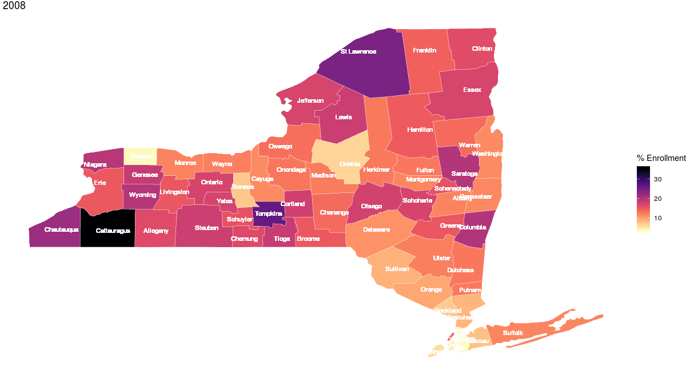

---
output:
  html_document:
    theme:  united
    css: index.css
    includes:
      after_body: footer.html
---

```{r}

```

```{r sample plot, include=FALSE, warning = FALSE, message = FALSE }
library(tidyverse)
library(ggplot2)
donor_share_time_compare = read.csv("data/state_donor_share.csv") %>%
  janitor::clean_names() %>%
  rename(state = x)
plot_1 = 
  ggplot(donor_share_time_compare, aes(x = year, y = donor_designation_share, color = state)) +
  geom_point() +
  geom_smooth()
```

```{r map part, include=FALSE, warning = FALSE, message = FALSE }
library(ggmap)
library(maps)
library(mapdata)
library(leaflet)
library(httr)
library(plotly)
library(lme4)
library(modelr)
#install.packages(c("leaflet", "plotly"))
# use the API to pull data

organ <- GET("https://health.data.ny.gov/resource/km5a-7zrs.csv?$limit=10000") %>% 
  content("parsed") %>%
  janitor::clean_names() %>%
  filter(county != "TOTAL NYS" & county != "Out of State" & county != "Unknown") %>%
  mutate(year = as.character(year)) %>%
  mutate(month = as.character(month)) %>%
  mutate(dummy_day = as.character("01")) %>%
  mutate(date = (str_c(year, month, dummy_day, sep = "-"))) %>%
  mutate(date = as.Date(date, "%Y-%m-%d"))

# Tidy the data for plot the donation map

organ_tidy = 
  organ %>% 
  separate(location, c("lat", "long"), sep = ",") %>% 
  mutate(long = str_replace(long, "\\)", ""),
         long = as.numeric(long)) %>% 
  mutate(lat = str_replace(lat, "\\(", ""),
         lat = as.numeric(lat)) 

ny = map_data("state") %>% 
  filter(region == "new york")

ny_county = map_data("county")  %>% 
  filter(region == "new york") %>% 
  as.tibble() %>% 
  rename(county = subregion)

organ_df = 
  organ_tidy %>% 
  filter(date == "2018-09-01") %>% 
  dplyr::select(eligible_population_enrolled, county) %>% 
  mutate(county = tolower(county)) %>% 
  mutate(county = recode(county,  'cattauragus' = 'cattaraugus'))

ny_county_combined = 
  full_join(organ_df, ny_county, by = 'county')

df_1 = organ_df %>% distinct(county) 
df_2 = ny_county %>% distinct(county) 


# Mapping

p = 
  ggplot() + 
  geom_polygon(data = ny_county_combined, 
               aes(x = long, 
                   y = lat, 
                   group = group, 
                   fill = eligible_population_enrolled)) +
  geom_path(data = ny_county_combined, 
            aes(x = long, 
                y = lat,
                group = group), 
            color = "white", 
            size = 0.1) +
  geom_text(data = organ_tidy, 
            aes(x = long, 
                y = lat, 
                label = county),
            size = 5,
            color = "white") +
  labs(x = '', y = '', title = '', fill = '% Enrollment') +
  theme(legend.position = "bottom", legend.title = element_text(size = 20)) +
  theme_void()+
  coord_equal() +
  viridis::scale_fill_viridis(option = "magma", direction = -1)


```

<a href="https://github.com/jackyan0320/p8105_final_project" class="github-corner" aria-label="View source on Github"><svg width="80" height="80" viewBox="0 0 250 250" style="fill:#dd4814; color:#fff; position: absolute; top: 50; border: 0; right: 0;" aria-hidden="true"><path d="M0,0 L115,115 L130,115 L142,142 L250,250 L250,0 Z"></path><path d="M128.3,109.0 C113.8,99.7 119.0,89.6 119.0,89.6 C122.0,82.7 120.5,78.6 120.5,78.6 C119.2,72.0 123.4,76.3 123.4,76.3 C127.3,80.9 125.5,87.3 125.5,87.3 C122.9,97.6 130.6,101.9 134.4,103.2" fill="currentColor" style="transform-origin: 130px 106px;" class="octo-arm"></path><path d="M115.0,115.0 C114.9,115.1 118.7,116.5 119.8,115.4 L133.7,101.6 C136.9,99.2 139.9,98.4 142.2,98.6 C133.8,88.0 127.5,74.4 143.8,58.0 C148.5,53.4 154.0,51.2 159.7,51.0 C160.3,49.4 163.2,43.6 171.4,40.1 C171.4,40.1 176.1,42.5 178.8,56.2 C183.1,58.6 187.2,61.8 190.9,65.4 C194.5,69.0 197.7,73.2 200.1,77.6 C213.8,80.2 216.3,84.9 216.3,84.9 C212.7,93.1 206.9,96.0 205.4,96.6 C205.1,102.4 203.0,107.8 198.3,112.5 C181.9,128.9 168.3,122.5 157.7,114.1 C157.9,116.9 156.7,120.9 152.7,124.9 L141.0,136.5 C139.8,137.7 141.6,141.9 141.8,141.8 Z" fill="currentColor" class="octo-body"></path></svg></a><style>.github-corner:hover .octo-arm{animation:octocat-wave 560ms ease-in-out}@keyframes octocat-wave{0%,100%{transform:rotate(0)}20%,60%{transform:rotate(-25deg)}40%,80%{transform:rotate(10deg)}}@media (max-width:500px){.github-corner:hover .octo-arm{animation:none}.github-corner .octo-arm{animation:octocat-wave 560ms ease-in-out}} </style>


<div class="cd-fixed-bg cd-fixed-bg--1"> 
  <h1 class = "front-page-title" style = "padding-top:10%">
    P8105 Final Project - NY Organ Donation 
  <h1>
</div> 

<div >
</br>
</div>


<div class = "plot_description">
  <h1>   </h1>
  <h1>   </h1>
  <h1> New York State </h1>
  <h2>Registration Rate 2008 - 2018 
      <h4  style="margin-left: 70%;"> [Explore Change by Years Shiny](https://sijiayue.shinyapps.io/shinny_heatmap/)<a href= "interesting_finding.html"> <i class="fa fa-space-shuttle" aria-hidden="true"></i> </a> <h4> 
  </h2>
</div>


<h1></h1>
<p></p>

<div class="slidecontainer">
  
  <p>Year: <span id="demo"></span></p>
  <input type="range" min="2008" max="2018" value="2008" class="slider" id="myRange">

</div>


<div class = "single_map_plot">
```{r, warning = FALSE, message = FALSE, echo=FALSE, fig.height = 14, fig.width = 25}
# plot part 

```

</div>


<div class = "divider" 
     style = "padding-top: 50px;
              padding-right: 30px;
              padding-bottom: 50px;
              padding-left: 80px;
              clear : both">
  <hr class = "style-two"></hr>
</div>


<div class = "plot_description">
  <h1> Registration Over Time </h1>
  <h2> a generally increasing trend across the years  </h2>
  <h4  style="margin-left: 60%;"> [READ MORE](interesting_finding.html)<a href= "interesting_finding.html"> <i class="fab fa-wpexplorer"></i> </a> <h4>
  
</div>

<div>
 <section class="plotting_main">
  <div class = "plot_1_plot">
```{r, warning = FALSE, message = FALSE, echo=FALSE, fig.height = 6.5, fig.width = 9}
  # plot part
county_enrollment_plot = 
  organ %>% 
  ggplot(aes(x = date, y = registry_enrollments, color = county)) +
    geom_line() +
    labs(x = "Date", 
         y = "Persons enrolled", 
         title = " ") + 
  viridis::scale_color_viridis(discrete = TRUE)

ggplotly(county_enrollment_plot)
```
  </div>
  
<div class = "plot_1_description">

<h3>The registry enrollments showed a generally increasing trend across the years. However, note that there is a sudden change in registry enrollments on 2009-06-01 and 2017-10-1. Curiously, the enrollment even declined for some counties on 2017-10-1, which indicates an aspect of limitation of the dataset.
</h3>

</div>
</section>


 <div class = "divider" 
     style = "padding-top: 50px;
              padding-right: 30px;
              padding-bottom: 50px;
              padding-left: 80px;
              clear : both">
  <br><br>
  <h2></h2>
  <hr class = "style-two"></hr>
</div>


 <div class = "plot_description">
  <h1> Policy Analysis </h1>
  <h2> Legislative policy that affect donnor registration rate <h2>
  <h4  style="margin-left: 60%;"> [READ MORE](nick_page.html)<a href= "nick_page.html"> <i class="fab fa-wpexplorer"></i> </a> <h4>
<div>
 <section class="plotting_main">
  <div class = "plot_2_plot">
```{r, warning = FALSE, message = FALSE, echo=FALSE, fig.height = 6.5, fig.width = 9}
organ_sp <- read_csv("data/organ_spline.csv") %>% 
  filter(!(county %in% c("TOTAL NYS", "Cattauragus", "St Lawrence"))) %>% 
  mutate(opo = as_factor(opo), 
         opo = fct_relevel(opo, 
                           "New York Organ Donor Network", 
                           "Center for Donation and Transplant in New York", 
                           "UNYTS", 
                           "Finger Lakes Donor Recovery Network")) 
all_sp_model <- organ_sp %>% 
  lmer(eligible_population_enrolled ~ total_days + year_sp_2012 + year_sp_2016 + year_sp_2017 + opo + 
         (1 | county), data = ., REML = FALSE)

add_predictions(organ_sp, all_sp_model) %>% 
  ggplot(aes(x = total_days, y = pred, color = opo, type = county)) + 
  geom_line() +
  viridis::scale_color_viridis(discrete = TRUE) + 
  geom_vline(xintercept = 1491, linetype = "dashed") + 
  geom_vline(xintercept = 2799, linetype = "dashed") + 
  geom_vline(xintercept = 3088, linetype = "dashed") + 
  annotate(geom = "text", x = 1720, y = 5, label = "2012") +
  annotate(geom = "text", x = 2600, y = 5, label = "2016") +
  annotate(geom = "text", x = 3300, y = 9, label = "2017") +
  theme(legend.position = "bottom", 
        legend.title = element_blank()) + 
  guides(color = guide_legend(ncol = 2)) + 
  labs(title = "", 
       subtitle = "Modeling all splines", 
       x = "Time as total days", 
       y = "Eligible population enrolled (%)")
```
  </div>
  
<div class = "plot_2_description">

<h3>2012 policy INSERT WHAT THIS POLICY WAS; a model including a term for a spline corresponding with a 2016 policy INSERT WHAT THIS POLICY WAS; a model including a term for a spline corresponding with a 2017 policy that lowered the age from eligible enrollees from 18 to 16 years old
</h3>
</div>
</section>


 <div class = "divider" 
     style = "padding-top: 50px;
              padding-right: 30px;
              padding-bottom: 50px;
              padding-left: 80px;
              clear : both">
  <br><br>
  <h2></h2>
  <hr class = "style-two"></hr>
</div>

 </section>
 <div class = "plot_description">
  <h1> Plot #3 Title </h1>
  <h2> Plot description <h2>
<div>
 <section class="plotting_main">
   
<div class = "plot_3_description" style = "border:none">
Lorem ipsum dolor sit amet, consectetur adipiscing elit. 
</div>
 <div class = "plot_3_plot">
```{r, warning = FALSE, message = FALSE, echo=FALSE, fig.height = 10, fig.width = 10}
# plot part 

```
</div>
</section>


<div class="embed-responsive embed-responsive-16by9" >
<iframe width="560" height="315" src="https://www.youtube.com/embed/aJOTlE1K90k?start=9" frameborder="0" allow="accelerometer; autoplay; encrypted-media; gyroscope; picture-in-picture" allowfullscreen></iframe>
</div>


<div style = "text-align: left;">
  <h6>Image sources :</h6> 
  <h6>1: healthconceptsltd.com</h6> 
  <h6>2: thejakartapost.com</h6> 
</div>


<style>
.slidecontainer {
    width: 90%;
    margin:auto;
}

.slider {
    -webkit-appearance: none;
    width: 80%;
    height: 35px;
    background: #d3d3d3;
    outline: none;
    opacity: 0.7;
    -webkit-transition: .2s;
    transition: opacity .2s;
}

.slider:hover {
    opacity: 1;
}

.slider::-webkit-slider-thumb {
    -webkit-appearance: none;
    appearance: none;
    width: 25px;
    height: 25px;
    background: #4CAF50;
    cursor: pointer;
}

.slider::-moz-range-thumb {
    width: 25px;
    height: 25px;
    background: #4CAF50;
    cursor: pointer;
}
</style>


<script>
var slider = document.getElementById("myRange");
var output = document.getElementById("demo");
output.innerHTML = slider.value;

slider.oninput = function() {
  output.innerHTML = this.value;
  document.getElementById("mapImg").src = 'website_img_maps/' + this.value + '.png';
}
</script>

